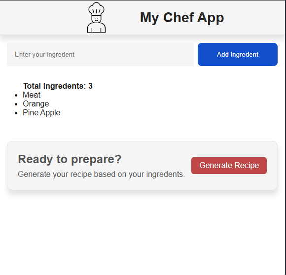
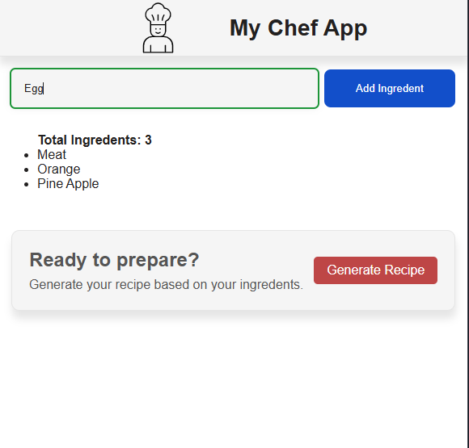

# Chief App
An innovative recipe and meal-planning app built with React that helps users discover, organize, and share their favorite recipes with a user-friendly interface.
# ✨ Features
Recipe Discovery: Browse and search for recipes based on ingredients, cuisine, or meal type.
Meal Planning: Create a weekly meal plan by adding recipes to a calendar.
Recipe Sharing: Contribute to the community by uploading your own recipes with photos and instructions.
Responsive Design: Enjoy a seamless experience on any device, from desktop to mobile.
# 💻 Technologies Used
React: The core JavaScript library for building the user interface.
[External API]: (TheMealDB, Spoonacular) to fetch and display recipe data.
[Backend Technology]
[Styling Library]:  CSS, Tailwind CSS.
[Other Libraries]:  React Router for navigation, Redux for state management.

# 🛠️ Installation and Setup
To run this project locally, follow these steps:
Clone the repository:
sh
git clone https://github.com/techgit41/Chief-App

Use code with caution.

Navigate to the project directory:

cd https://github.com/techgit41/Chief-App

Install dependencies:

npm install

Start the development server:

npm start
Use code with caution.

Open in your browser:
The application will open automatically in your web browser at http://localhost:3000.
# 🖼️ Screenshots
1. user interface
# 
2. adding ingredent
# 

# 🤝 Contributing
Contributions are always welcome! If you have suggestions for new features, find a bug, or want to improve the code, please feel free to create an issue or submit a pull request.
# 📜 License
This project is licensed under the MIT License.
